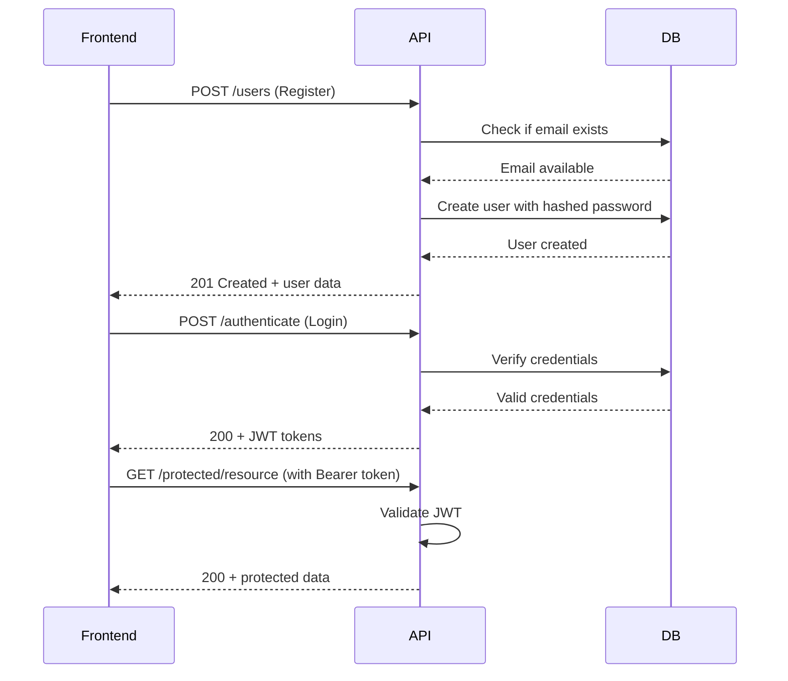
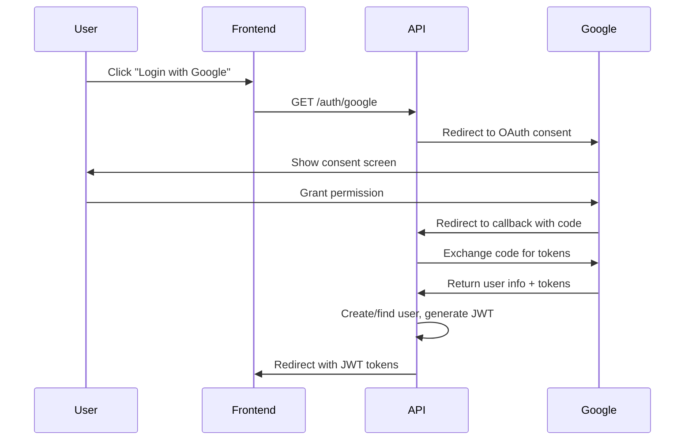

# Authentication API - Frontend Integration Guide

This document provides detailed technical specifications for frontend developers integrating with the Trippy authentication system.

## Table of Contents

1. [Overview](#overview)
2. [Base Configuration](#base-configuration)
3. [Authentication Flows](#authentication-flows)
4. [API Endpoints](#api-endpoints)
5. [Error Handling](#error-handling)
6. [Token Management](#token-management)
7. [Security Considerations](#security-considerations)
8. [Code Examples](#code-examples)
9. [Testing](#testing)

## Overview

The Trippy authentication system supports two authentication methods:
- **Password-based authentication** (email/password)
- **OAuth authentication** (Google, with extensible support for other providers)

Both methods return JWT tokens that must be included in subsequent API requests.

## Base Configuration

### API Base URL
```
Development: http://localhost:5001/api
Production: https://your-domain.com/api
```

### Required Headers
For authenticated requests:
```
Authorization: Bearer <jwt_token>
Content-Type: application/json
```

### CORS Configuration
The API accepts requests from:
- Development: `http://localhost:3000` (and other common dev ports)
- Production: Your configured frontend domain

## Authentication Flows

### 1. Password Authentication Flow



### 2. OAuth Authentication Flow (Google)



## API Endpoints

### 1. User Registration (Password)

**Endpoint**: `POST /api/users`

**Description**: Register a new user with email and password

**Request Body**:
```json
{
  "email": "user@example.com",
  "password": "SecurePassword123!",
  "username": "johndoe",
  "firstName": "John",
  "lastName": "Doe",
  "avatarURL": "https://example.com/avatar.jpg",
  "phoneNumber": "+1234567890",
  "dateOfBirth": "1990-01-01",
  "gender": "male",
  "role": "user"
}
```

**Required Fields**: `email`, `password`

**Response (201 Created)**:
```json
{
  "success": true,
  "result": {
    "user": {
      "id": "uuid-string",
      "email": "user@example.com",
      "username": "johndoe",
      "firstName": "John",
      "lastName": "Doe",
      "avatarURL": "https://example.com/avatar.jpg",
      "role": "user",
      "createdAt": "2024-01-01T00:00:00Z"
    },
    "is_new_user": true
  }
}
```

**Error Responses**:
- `400 Bad Request`: Invalid data
  ```json
  {
    "success": false,
    "error": "Email: invalid email format"
  }
  ```
- `409 Conflict`: Email already exists
  ```json
  {
    "success": false,
    "error": "Email already taken"
  }
  ```

### 2. User Login (Password)

**Endpoint**: `POST /api/authenticate`

**Description**: Authenticate user with email and password

**Request Body**:
```json
{
  "username": "user@example.com",
  "password": "SecurePassword123!"
}
```

**Response (200 OK)**:
```json
{
  "success": true,
  "result": {
    "token": "eyJhbGciOiJIUzI1NiIsInR5cCI6IkpXVCJ9...",
    "refresh_token": "eyJhbGciOiJIUzI1NiIsInR5cCI6IkpXVCJ9...",
    "expire": "2024-01-02T00:00:00Z"
  }
}
```

**Error Responses**:
- `401 Unauthorized`: Invalid credentials
  ```json
  {
    "success": false,
    "error": "Invalid username or password"
  }
  ```

### 3. OAuth Initiation

**Endpoint**: `GET /api/auth/{provider}`

**Description**: Initiate OAuth flow with specified provider

**URL Parameters**:
- `provider`: OAuth provider name (e.g., `google`)

**Response**: Redirect to provider's OAuth page

### 4. OAuth Callback

**Endpoint**: `GET /api/auth/{provider}/callback`

**Description**: Handle OAuth callback from provider

**URL Parameters**:
- `provider`: OAuth provider name
- `code`: Authorization code (from provider)
- `state`: CSRF protection state

**Response (200 OK)**:
```json
{
  "success": true,
  "result": {
    "token": "eyJhbGciOiJIUzI1NiIsInR5cCI6IkpXVCJ9...",
    "refresh_token": "eyJhbGciOiJIUzI1NiIsInR5cCI6IkpXVCJ9...",
    "expire": "2024-01-02T00:00:00Z"
  }
}
```

**Error Responses**:
- `401 Unauthorized`: OAuth failed
  ```json
  {
    "success": false,
    "error": "OAuth authentication failed"
  }
  ```

### 5. Token Refresh

**Endpoint**: `POST /api/refresh_token`

**Description**: Refresh JWT token using refresh token

**Headers**:
```
Authorization: Bearer <refresh_token>
```

**Response (200 OK)**:
```json
{
  "success": true,
  "result": {
    "token": "eyJhbGciOiJIUzI1NiIsInR5cCI6IkpXVCJ9...",
    "refresh_token": "eyJhbGciOiJIUzI1NiIsInR5cCI6IkpXVCJ9...",
    "expire": "2024-01-02T00:00:00Z"
  }
}
```

### 6. Get Current User

**Endpoint**: `GET /api/identity`

**Description**: Get information about the authenticated user

**Headers**:
```
Authorization: Bearer <jwt_token>
```

**Response (200 OK)**:
```json
{
  "success": true,
  "result": {
    "userName": "johndoe",
    "firstName": "John",
    "lastName": "Doe",
    "role": "user",
    "organizationID": "org-uuid"
  }
}
```

### 7. Generate Permanent Token

**Endpoint**: `GET /api/generate-token`

**Description**: Generate a long-lived token for third-party integrations

**Headers**:
```
Authorization: Bearer <jwt_token>
```

**Response (200 OK)**:
```json
{
  "success": true,
  "result": "permanent-token-string"
}
```

## Error Handling

### Standard Error Format

All error responses follow this format:

```json
{
  "success": false,
  "error": "Human-readable error message"
}
```

### HTTP Status Codes

| Status | Meaning | When to Handle |
|--------|---------|----------------|
| 200 | Success | Successful operation |
| 201 | Created | Resource created successfully |
| 400 | Bad Request | Invalid input data |
| 401 | Unauthorized | Authentication required/failed |
| 403 | Forbidden | Insufficient permissions |
| 404 | Not Found | Resource not found |
| 409 | Conflict | Resource already exists |
| 500 | Server Error | Internal server error |

### Client-Side Error Handling

```javascript
// Example error handling in JavaScript
async function apiRequest(url, options = {}) {
  try {
    const response = await fetch(url, {
      ...options,
      headers: {
        'Content-Type': 'application/json',
        ...options.headers,
      },
    });
    
    const data = await response.json();
    
    if (!response.ok) {
      // Handle specific error cases
      if (response.status === 401) {
        // Redirect to login
        window.location.href = '/login';
      } else if (response.status === 409) {
        // Show email exists error
        throw new Error(data.error);
      } else {
        throw new Error(data.error || 'Request failed');
      }
    }
    
    return data;
  } catch (error) {
    console.error('API Error:', error);
    throw error;
  }
}
```

## Token Management

### JWT Token Structure

The JWT token contains the following claims:

```json
{
  "exp": 1704067200,
  "id": "user-uuid",
  "role": "user",
  "firstName": "John",
  "lastName": "Doe",
  "organizationID": "org-uuid",
  "userName": "johndoe"
}
```

### Token Storage Recommendations

1. **Access Token**: Store in memory or secure httpOnly cookie
2. **Refresh Token**: Store in secure httpOnly cookie or encrypted localStorage
3. **Never store tokens in plain localStorage** in production

### Token Refresh Strategy

```javascript
// Automatic token refresh
let isRefreshing = false;
let refreshSubscribers = [];

async function refreshToken() {
  if (isRefreshing) {
    return new Promise((resolve) => {
      refreshSubscribers.push(resolve);
    });
  }
  
  isRefreshing = true;
  
  try {
    const refreshToken = getRefreshToken();
    const response = await fetch('/api/refresh_token', {
      method: 'POST',
      headers: {
        'Authorization': `Bearer ${refreshToken}`
      }
    });
    
    const data = await response.json();
    
    if (response.ok) {
      setAccessToken(data.result.token);
      setRefreshToken(data.result.refresh_token);
      
      // Notify all waiting requests
      refreshSubscribers.forEach(resolve => resolve());
      refreshSubscribers = [];
      
      return data.result.token;
    } else {
      // Refresh failed, redirect to login
      logout();
      throw new Error('Token refresh failed');
    }
  } finally {
    isRefreshing = false;
  }
}
```

## Security Considerations

### 1. HTTPS Only
Always use HTTPS in production to protect tokens in transit.

### 2. Token Expiration
- Access tokens expire after 14 hours
- Refresh tokens should be used to obtain new access tokens
- Implement automatic token refresh on the client

### 3. CSRF Protection
- OAuth flows include state parameter for CSRF protection
- Use SameSite cookies for additional security

### 4. XSS Prevention
- Sanitize all user inputs
- Use Content Security Policy (CSP)
- Avoid storing sensitive data in localStorage

### 5. Secure Headers
The API includes these security headers:
```
X-Content-Type-Options: nosniff
X-Frame-Options: DENY
X-XSS-Protection: 1; mode=block
```

## Code Examples

### React Example

```jsx
// AuthContext.js
import React, { createContext, useContext, useReducer, useEffect } from 'react';

const AuthContext = createContext();

const authReducer = (state, action) => {
  switch (action.type) {
    case 'LOGIN':
      return {
        ...state,
        isAuthenticated: true,
        user: action.payload.user,
        token: action.payload.token,
      };
    case 'LOGOUT':
      return {
        ...state,
        isAuthenticated: false,
        user: null,
        token: null,
      };
    default:
      return state;
  }
};

export const AuthProvider = ({ children }) => {
  const [state, dispatch] = useReducer(authReducer, {
    isAuthenticated: false,
    user: null,
    token: null,
  });

  // Login with password
  const login = async (email, password) => {
    try {
      const response = await fetch('/api/authenticate', {
        method: 'POST',
        headers: { 'Content-Type': 'application/json' },
        body: JSON.stringify({ username: email, password }),
      });
      
      const data = await response.json();
      
      if (response.ok) {
        localStorage.setItem('token', data.result.token);
        dispatch({
          type: 'LOGIN',
          payload: {
            token: data.result.token,
            user: data.result.user,
          },
        });
      } else {
        throw new Error(data.error);
      }
    } catch (error) {
      console.error('Login failed:', error);
      throw error;
    }
  };

  // OAuth login
  const loginWithOAuth = (provider) => {
    window.location.href = `/api/auth/${provider}`;
  };

  // Logout
  const logout = () => {
    localStorage.removeItem('token');
    dispatch({ type: 'LOGOUT' });
  };

  return (
    <AuthContext.Provider
      value={{
        ...state,
        login,
        loginWithOAuth,
        logout,
      }}
    >
      {children}
    </AuthContext.Provider>
  );
};

export const useAuth = () => {
  const context = useContext(AuthContext);
  if (!context) {
    throw new Error('useAuth must be used within AuthProvider');
  }
  return context;
};
```

### Axios Interceptor Example

```javascript
// api.js
import axios from 'axios';

const api = axios.create({
  baseURL: process.env.REACT_APP_API_URL,
});

// Request interceptor to add auth token
api.interceptors.request.use(
  (config) => {
    const token = localStorage.getItem('token');
    if (token) {
      config.headers.Authorization = `Bearer ${token}`;
    }
    return config;
  },
  (error) => {
    return Promise.reject(error);
  }
);

// Response interceptor to handle token refresh
api.interceptors.response.use(
  (response) => response,
  async (error) => {
    const originalRequest = error.config;
    
    if (error.response?.status === 401 && !originalRequest._retry) {
      originalRequest._retry = true;
      
      try {
        const refreshToken = localStorage.getItem('refreshToken');
        const response = await axios.post('/api/refresh_token', null, {
          headers: {
            Authorization: `Bearer ${refreshToken}`,
          },
        });
        
        const { token, refresh_token } = response.data.result;
        localStorage.setItem('token', token);
        localStorage.setItem('refreshToken', refresh_token);
        
        // Retry original request
        originalRequest.headers.Authorization = `Bearer ${token}`;
        return api(originalRequest);
      } catch (refreshError) {
        // Refresh failed, logout user
        localStorage.removeItem('token');
        localStorage.removeItem('refreshToken');
        window.location.href = '/login';
        return Promise.reject(refreshError);
      }
    }
    
    return Promise.reject(error);
  }
);

export default api;
```

## Testing

### Test Environment Setup

For testing, use the development server:
```
Base URL: http://localhost:5001/api
```

### Test Credentials

The API supports test mode. Set environment variable:
```
ENV=test
```

### Example Test Cases

```javascript
// Jest example
describe('Authentication', () => {
  test('should register new user', async () => {
    const userData = {
      email: 'test@example.com',
      password: 'TestPassword123!',
      username: 'testuser',
    };
    
    const response = await request(app)
      .post('/api/users')
      .send(userData)
      .expect(201);
    
    expect(response.body.result.user.email).toBe(userData.email);
    expect(response.body.result.is_new_user).toBe(true);
  });

  test('should login with valid credentials', async () => {
    const credentials = {
      username: 'test@example.com',
      password: 'TestPassword123!',
    };
    
    const response = await request(app)
      .post('/api/authenticate')
      .send(credentials)
      .expect(200);
    
    expect(response.body.result.token).toBeDefined();
    expect(response.body.result.refresh_token).toBeDefined();
  });
});
```

## Support

For authentication-related issues:
- Check the browser console for detailed error messages
- Verify network requests in browser dev tools
- Ensure CORS is properly configured
- Contact backend team at: malek.radhouen@gmail.com

## Additional Resources

- [JWT.io](https://jwt.io/) - JWT token debugger
- [OAuth 2.0 Documentation](https://oauth.net/2/)
- [Postman Collection: [Link to collection]
- API Documentation: http://localhost:5001/swagger/index.html
